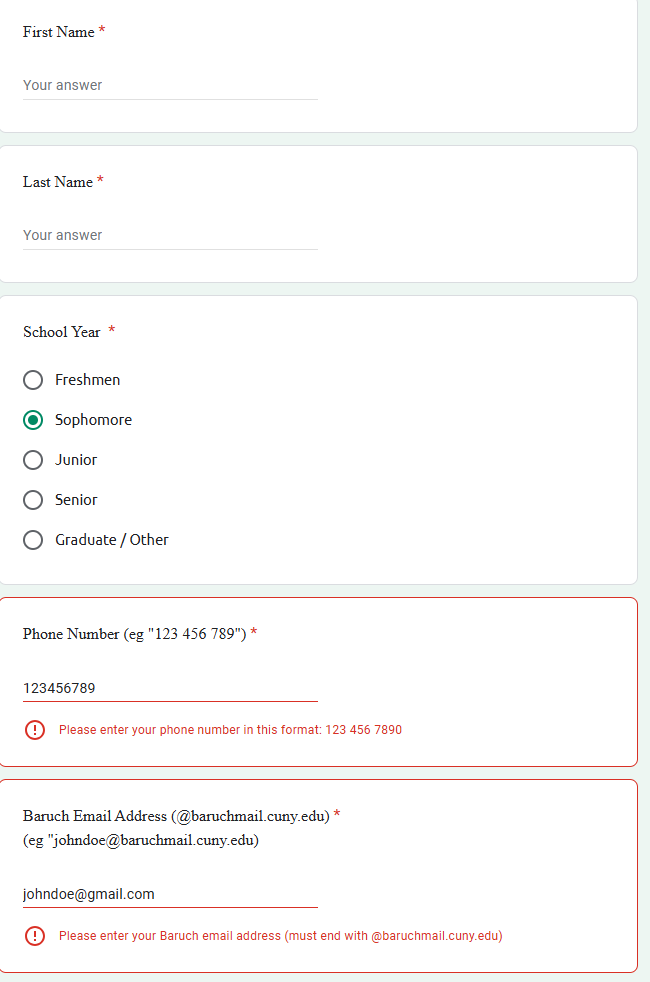
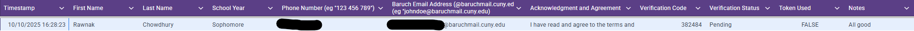
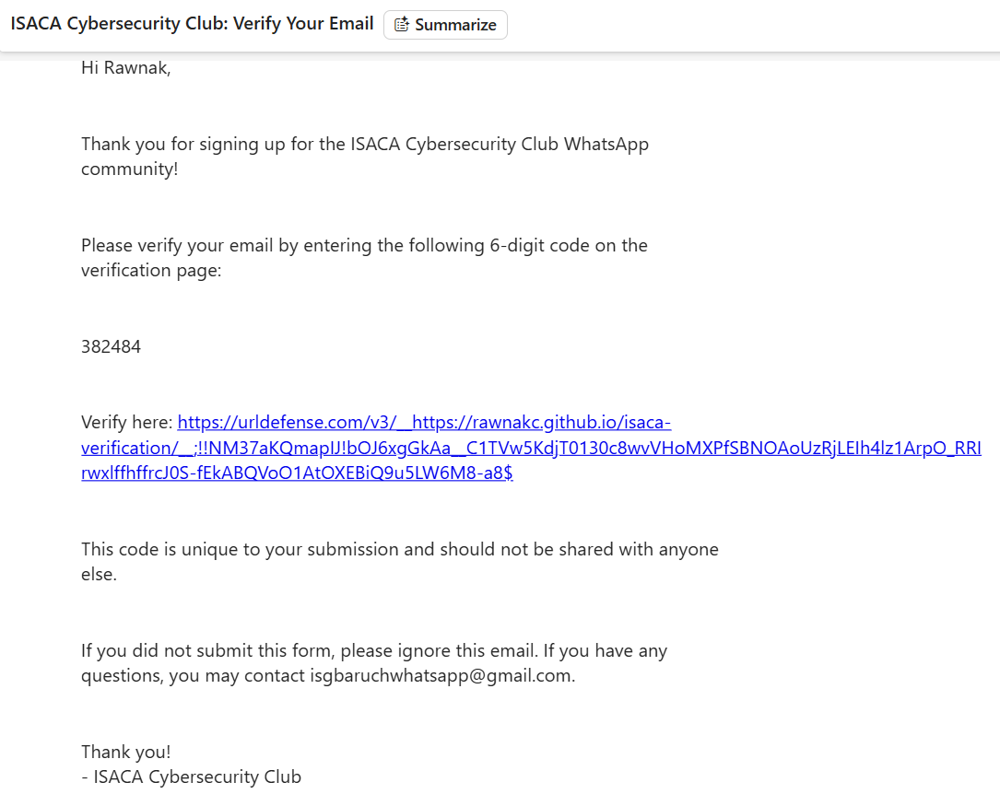
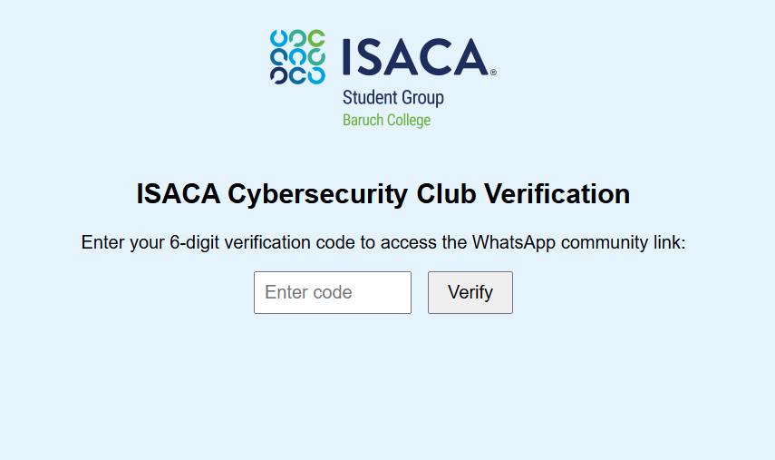
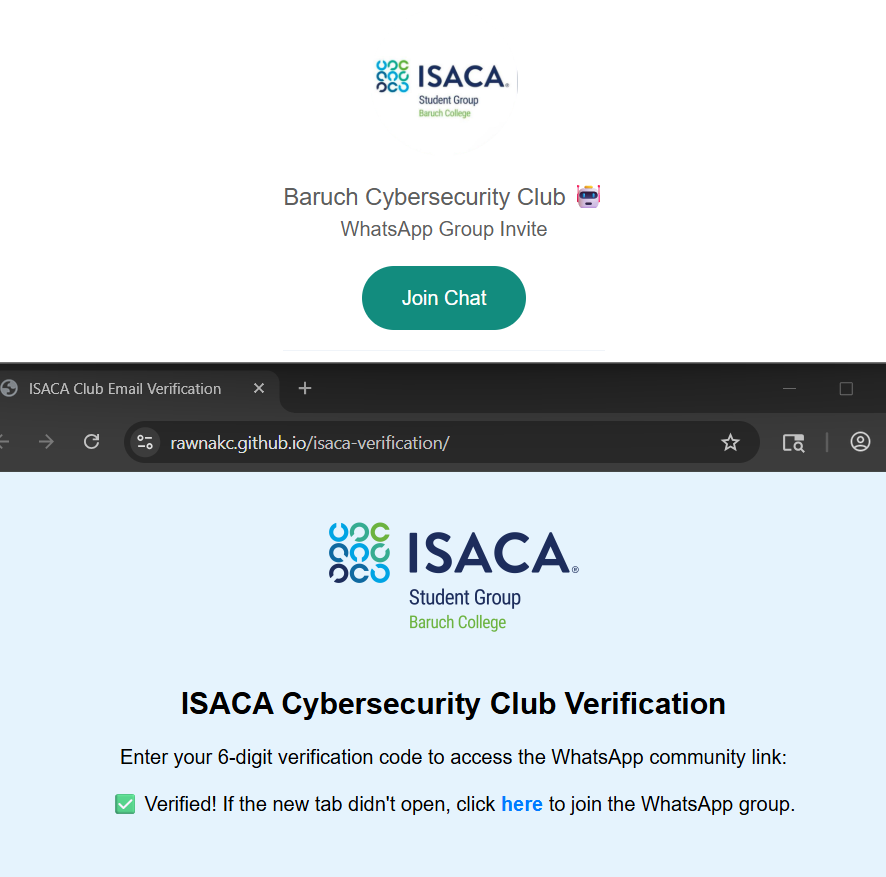
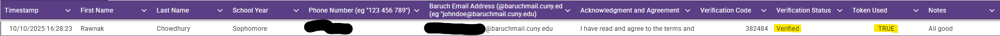

# ISACA Cybersecurity Club WhatsApp Verification System   

## Project Overview
Originally, our organization included a  direct WhatsApp invite link on our Linktree that students could simply join through. Their was no verification or additional measures for joining the community chat. 
So as a result, their would be 4-6 incidents a week where a random user that typically had a area code from outside of NY but also commonly outside of the country. These users would post suspicious content ranging from selling concert tickets, certification discounts, study group links, and more.
The goal of this project was to ensure that only Baruch students were able to sign up for our WhatsApp community chat, and this was done through the use of creating a workflow that filters through students phone numbers and email addresses to make sure that they really are Baruch students, and requiring additional email verification through a 3rd party web page.

This project utilizes:
- **Google App Scripts (Backend)** -> Scripts written in JavaScript to filter form submissions, generate unique codes for verification use on 3rd party site, and organizes the spreadsheet for users verification status
- **GitHub Pages (Frontend)** -> Hosts a verification page written with HTML and a bit of JavaScript for fetching from Google App Scripts API. Users enter their verification code on this site which matches against the spreadsheet where form submissions are logged.
- **Google Sheets** -> Used to store all form responses and verification statuses of students
- **Gmail Service** -> Google App Scripts utilize Gmail platform to send out email for students to verify their email

---

## Step by Step Workflow 

1. **User Submits Form**
   User fills out the Google Form with their name, school year, phone number, and email. Their phone number and email must be entered in the given format as shown. I implemented custom response validation to make sure that only US-format numbers can be entered as well as email addresses ending in Baruch College's domain.
    

2. **Initial Sheet after User Submits Form**
   After the user submits the form, the backend logic from **formfilter.gs** will look through the submitted information.
   For the phone number, if its within the local tri-state area (NY, NJ, CT) then it won't be flagged. If the phone number is from outside of the given area codes, it will be flagged with yellow shading and a note saying "Not a local area code".
   For the email, although we have response validation so it technically shouldn't be possible, if a user were to somehow bypass and utilize a email that doesn't use Baruch College's domain, it would be flagged with red shading and a note saying "Invalid email".
   As long as the user inputs a valid Baruch College email, they will receive the email to verify themselves and then be redirected to the WhatsApp link. A non-local area code number will be flagged, and a invalid email will not be sent the email to verify and will not receive the WhatsApp invite link.
   On the spreadsheet, the users verification status will change to "Pending" and their Token use will change to "FALSE" as they have not yet verified themselves.
    

3. **User Receives Email with Verification Code and Link to Verification Site**
   The **formfilter.gs** backend script sends an automatic email to those who had a valid form submission. This script also includes a function that generates a random 6 digit code. This code is sent along with this email as well as a link to a GitHub Page site where they can verify themselves with their given code.
    

4. **User Visits Verification Page**
   Once the user clicks on the link that was apart of the automated email, they will be directed to a GitHub Page. On this site, they will be asked to enter their 6 digit code that they received.
   The value the user enters into this input box is matched against what is in the spreadsheet because when the user submits the form, the code is generated and put into their row as well.
   

5. **User Verifies with their Code and is Redirected to WhatsApp invite link**
   Once the user enters their code, if its a valid code, a new tab will open to the WhatsApp invite link to join the community chat. Their is also a fallback on the Github Page itself for a hyperlink to the WhatsApp invite link in the case the tab unexpectedly doesn't open.
   If we also look back to the spreadsheet, their verification status will change to Verified and the Token status will change to "TRUE" signaling the user verified themselves with a real code emailed to them.
    
    

## Frontend Overview (GitHub Pages) 

The frontend is a simple HTML + JavaScript page that is hosted on GitHub Pages. 
Essentially what it does is: 
- Displays a verification input form for the user's 6 digit code
- Sends a JSON POST request to the Google App Scripts Web App API to match this code against the respective row in the form response spreadsheet
- Handles and displays responses. If a code works, it will show as "Verified". If its the wrong code, it will show as "Invalid". If the code has already been used, it will show as "Already used"
- Once the user enters a valid code, a new tab with the WhatsApp invite link opens for the user to join our community chat.

Deployed URL Example: 
`https://rawnakc.github.io/isaca-verification/`

---

## Backend Overview (Google App Script)

The backend is composed of two main scripts written in JavaScript: 
### 1. `formfilter.gs`
This script handles form submissions and tasks such as 
- Filtering through phone numbers and emails entered to ensure they match the expected area codes and email domain
- Generates a random 6 digit code, and uses the Email.app to automate emails to users that submit the form
- Logs the users entry, flags it if certain information is unexpected, and logs the code and verification status

### 2. `code.gs`
This script essentially serves as the underlying logic for our verification webpage: 
- Provides a Web App API with (doPost(e) functionality to securely accept POST requests from the frontend page
- Receives the users verification code and validates it against whats logged in the Google Sheet
- Updates the relevant verification status and token used upon successful validation

## Frontend -> Backend Integration 

- When the user submits their verficiation code on the GitHub Pages-hosted site, the frontend (index.html) sends a POST request to the Google Apps Script Web App URL (backend API)
- The backend (code.gs) receives this request with the **doGet(e)** function. Then the **checkCode()** function compares the submitted code to the one stored in the spreadsheet.
- If the code matches and hasn't been used, the frontend then receives a response with a JSON object to correalate the verification status to change to "Verified"
- If the code is invalid, it responds with a appropriate message

## Issues Faced and Fixes 

### Multiple Google Account Login Conflicts 
Originally, I was hosting the verification page (Frontend) off of the same Google App Scripts project that the backend logic is now on. However Google App Scripts commonly runs into a issue that I was experiencing while troubleshooting. The site worked fine in a incognito tab or when I was signed into just one Google account. 
However if I was signed into multiple accounts, Google App Script would pretty much mix up the sessions that I had on my browser, and so this would result in not being able to access the webpage. 

To solve this, I migrated my html to a site hosted off of GitHub Pages. I rebuilt the full frontend for my index.html code to be compatible with GitHub Pages. I also had to integrate communication between my backend Google App Scripts API to my frontend GitHub Pages using POST requests

### CORS Block after Migrating 
When the frontend on GitHub Pages first tried to POST the verification codes to the Google Apps Script Web App, the browser blocked the request due to CORS restrictions. This was seen in the console logs 

To solve this, I adjusted the Google App Scripts logic to use doGet(e) instead of doPost(e). With tis, the front end is able to properly pass the verificate code in a simple GET request to the backend. 
