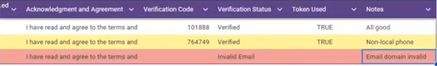

# ISACA Cybersecurity Club WhatsApp Verification System   

## Project Overview
Originally, our organization included a  direct WhatsApp invite link on our Linktree that students could simply join through. Their was no verification or additional measures for joining the community chat. 
So as a result, their would be 4-6 incidents a week where a random user that typically had a area code from outside of NY but also commonly outside of the country. These users would post suspicious content ranging from selling concert tickets, certification discounts, study group links, and more.
The goal of this project was to ensure that only Baruch students were able to sign up for our WhatsApp community chat, and this was done through the use of creating a workflow that filters through students phone numbers and email addresses to make sure that they really are Baruch students, and requiring additional email verification through a 3rd party web page.

This project utilizes:
- **Google App Scripts (Backend)** -> Scripts written in JavaScript to filter form submissions, generate unique verification codes, communicate with the frontend API, and organize the spreadsheet for user verification status
- **GitHub Pages (Frontend)** -> GitHub Pages (Frontend) - Hosts a verification page written in HTML and JavaScript that communicates with the Google Apps Script API via JSONP to validate user codes
- **Google Sheets** -> Used to store all form responses and verification statuses of students
- **Gmail Service** -> Google Apps Script utilizes the Gmail platform to send automated verification emails to students
---

## Step by Step Workflow 

1. **User Submits Form**
   User fills out the Google Form with their name, school year, phone number, and email. Their phone number and email must be entered in the given format as shown. I implemented custom response validation to make sure that only US-format numbers can be entered as well as email addresses ending in Baruch College's domain.
    

2. **Initial Sheet after User Submits Form**
   After the user submits the form, the backend logic from **formfilter.gs** will look through the submitted information.
   For the phone number, if its within the local tri-state area (NY, NJ, CT) then it won't be flagged. If the phone number is from outside of the given area codes, it will be flagged with yellow shading and a note saying "Not a local area code".
   For the email, although we have response validation so it technically shouldn't be possible, if a user were to somehow bypass and utilize a email that doesn't use Baruch College's domain, it would be flagged with red shading and a note saying "Invalid email".
   As long as the user inputs a valid Baruch College email, they will receive the email to verify themselves and then be redirected to the WhatsApp link. A non-local area code number will be flagged, and a invalid email will not be sent the email to verify and will not receive the WhatsApp invite link.
   On the spreadsheet, the users verification status will change to "Pending" and their Token use will change to "FALSE" as they have not yet verified themselves.
    

3. **User Receives Email with Verification Code and Link to Verification Site**
   The **formfilter.gs** backend script sends an automatic email to those who had a valid form submission. This script also includes a function that generates a random 6 digit code. This code is sent along with this email as well as a link to a GitHub Page site where they can verify themselves with their given code.
    

4. **User Visits Verification Page**
   Once the user clicks the link in the automated email, they are directed to the GitHub Pages verification site. On this page, they are prompted to enter their 6-digit verification code.
The verification process works as follows:
User enters their code on the frontend
Frontend sends the code to the Google Apps Script backend via JSONP (to avoid CORS issues)
Backend validates the code against the Google Sheet
Backend generates a one-time security token if the code is valid
Frontend retrieves the WhatsApp link using this token
Token expires after 5 minutes and is deleted after one use
   

5. **User Verifies with their Code and is Redirected to WhatsApp invite link**
   Once the user enters their code, if its a valid code, a new tab will open to the WhatsApp invite link to join the community chat. Their is also a fallback on the Github Page itself for a hyperlink to the WhatsApp invite link in the case the tab unexpectedly doesn't open.
   If we also look back to the spreadsheet, their verification status will change to Verified and the Token status will change to "TRUE" signaling the user verified themselves with a real code emailed to them.
    
    

## Frontend Overview (GitHub Pages) 

The frontend is a single-page HTML + JavaScript application hosted on GitHub Pages.
Key Features:

User Interface: Clean, branded verification form for entering 6-digit codes
JSONP Communication: Uses JSONP to communicate with Google Apps Script API (avoids CORS issues)
Two-Step Verification Process:

Sends code to backend → Receives one-time token
Sends token to backend → Receives WhatsApp link

Security: WhatsApp link is never exposed in the HTML source code
Error Handling: Displays appropriate messages for invalid codes, already-used codes, and expired tokens
Popup Blocking Fallback: Provides clickable link if browser blocks automatic tab opening
Responsive Design: Works on desktop and mobile devices

Deployed URL Example: 
`https://rawnakc.github.io/isaca-verification/`

---

## Backend Overview (Google App Script)

The backend is composed of two main scripts written in JavaScript: 

### 1. `formfilter.gs`
Handles form submissions and initial processing:

Phone Number Filtering: Validates area codes and flags non-local numbers
Email Validation: Ensures only Baruch College domain emails are accepted
Code Generation: Creates random 6-digit verification codes
Email Automation: Uses GmailApp to send verification emails to valid users
Spreadsheet Management: Logs entries, flags suspicious submissions, and tracks verification status

### 2. `code.gs`
Serves as the API backend for the verification webpage: 

Web App API: Provides a doGet(e) endpoint that accepts JSONP requests from the frontend
Code Validation: checkCode() function validates user codes against the Google Sheet
Token System: Generates one-time use tokens with 5-minute expiration for secure link delivery
Link Protection: WhatsApp link is only revealed after successful verification
Status Updates: Updates verification status and token usage upon successful validation

## Frontend -> Backend Integration 

Secure Communication Flow:

User Submits Code
Frontend (index.html) creates a JSONP request to the Google Apps Script Web App URL
Code is sent as a URL parameter: ?code=123456&callback=handleVerification

Backend Validates Code
Backend (code.gs) receives the request via doGet(e) function
checkCode() compares the submitted code to codes stored in the spreadsheet
If valid and unused, backend creates a one-time security token

Token Exchange
Backend returns JSON response with the token: {"status":"verified","token":"uuid-here"}
Frontend immediately requests the WhatsApp link using the token
Backend validates token, returns link, and deletes the token (one-time use)

Link Delivery
Frontend receives WhatsApp link: {"status":"success","link":"https://chat.whatsapp.com/..."}
Frontend opens link in new tab
User joins the community chat

## Issues Faced and Solutions
### Issue #1: Multiple Google Account Login Conflicts
Originally, the verification page (frontend) was hosted on Google Apps Script. When users were signed into multiple Google accounts, Apps Script would mix up browser sessions, resulting in access errors. The site worked fine in incognito mode or with a single account, but failed with multiple accounts.
### Solution:
Migrated the frontend HTML to GitHub Pages. This separation of concerns eliminated the multi-account session conflicts and provided a more reliable hosting solution. Rebuilt the frontend to be fully compatible with GitHub Pages and integrated JSONP-based communication with the backend API.

### Issue #2: CORS Blocking After Migration
Problem:
When the GitHub Pages frontend first attempted to communicate with the Google Apps Script backend, the browser blocked requests due to Cross-Origin Resource Sharing (CORS) restrictions. Standard fetch() and XMLHttpRequest calls were rejected.
### Solution:
Implemented JSONP (JSON with Padding) instead of standard HTTP requests. JSONP bypasses CORS restrictions by dynamically injecting <script> tags that load responses as JavaScript callbacks. The backend uses doGet(e) to handle JSONP requests and returns data wrapped in a callback function.

### Issue #3: WhatsApp Link Security Concerns
Problem:
If the WhatsApp link was included directly in the frontend HTML, anyone could inspect the page source and access the link without verification.
### Solution:
Implemented a two-step token-based verification system: Backend verifies the code and generates a one-time UUID token.Token is then stored in cache (5-minute expiration). Frontend receives only the token, not the WhatsApp link. Frontend immediately exchanges the token for the actual link. Backend deletes the token after use (one-time access)

This ensures the WhatsApp link is only accessible to users who successfully verify with a legitimate code, and tokens cannot be shared or reused.

## Setup Instructions
Prerequisites:

Google Account with access to Google Apps Script
GitHub account for hosting the frontend
Google Form connected to a Google Sheet

Backend Setup (Google Apps Script):
- Open Google Apps Script
- Go to your Google Sheet
- Click Extensions → Apps Script
- Add Scripts
- Create formfilter.gs for form processing
- Create code.gs for verification API

Configure Spreadsheet ID
- In code.gs, replace <YOUR_SPREADSHEET_ID> with your actual spreadsheet ID
- Find your spreadsheet ID in the URL: https://docs.google.com/spreadsheets/d/YOUR_ID_HERE/edit

Deploy Web App
- Click Deploy → New deployment
- Type: Web app
- Execute as: Me
- Who has access: Anyone
- Click Deploy and copy the deployment URL

Set Up Form Trigger
- Click Triggers (clock icon)
- Add trigger for formfilter.gs to run on form submission

Frontend Setup (GitHub Pages):
- Create Repository
- Create a new GitHub repository
- Add index.html to the repository

Update Script ID
- In index.html, replace <YOUR_SCRIPT_ID> with the ID from your deployment URL
- URL format: https://script.google.com/macros/s/YOUR_SCRIPT_ID/exec

Enable GitHub Pages
- Go to repository Settings → Pages
- Set source to main branch
- Save and note your GitHub Pages URL

Test the System
- Submit a test form
- Check email for verification code
- Visit GitHub Pages URL from email and enter code
- Verify WhatsApp link opens in new tab
